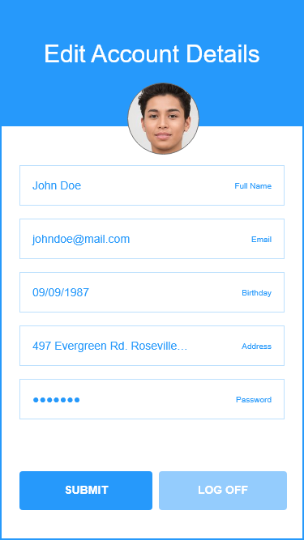

# Components

Before I start coding, I am identifying all of the components that I think that I will need. This may change once I get into the coding, but it will provide me with a good starting point.

 [Wireframe](would-you-rather.xd) 

#### Login Page

#### Sign Up (modal)

------

#### Home Page

##### unanswered question component

##### navigation component

------

#### Question Page

##### ask question component

#### Question Response Page

------

#### Leaderboard Page

##### question component

##### search

#### Ask a Question Page

#### User Detail Page

#### User Profile (modal)

